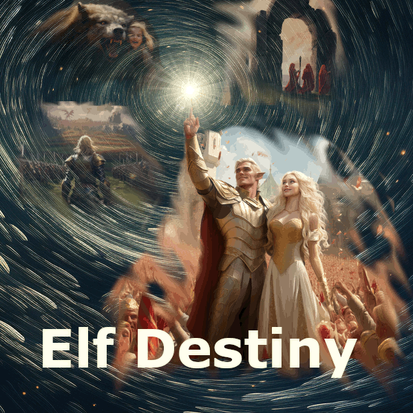

# Elf Destiny

Thank you for visiting the official Repository of the Europa Universalis 5 Mod, Elf Destiny!

## Want To Contribute?

First off, thank you!

Visit the Mod's Discord linked down below and reach out to the Admin user **Eastpointed**. He will add you to the repo's contributors!

## Links

- **Wiki:** https://galacticliaison.github.io/elf-destiny-wiki/
- **Steam:** TBD
- **Discord:** https://discord.gg/fyuPcf5HFZ
- **Reddit:** https://www.reddit.com/r/ElfDestiny/
- **Ko-fi:** https://ko-fi.com/elf_destiny

---

## For contributors

This mod is one of five repos that make up the Elf Destiny project family — the mod itself, the CK3 sister mod, the wiki, the Discord bot, and the lore-master research workbench. See `c:\projects\elf-destiny-lore-master\ECOSYSTEM.md` for the cross-project map: how lore flows into the wiki, how bug reports flow from Discord and the wiki into a single triage channel, and which piece of infrastructure runs where.
